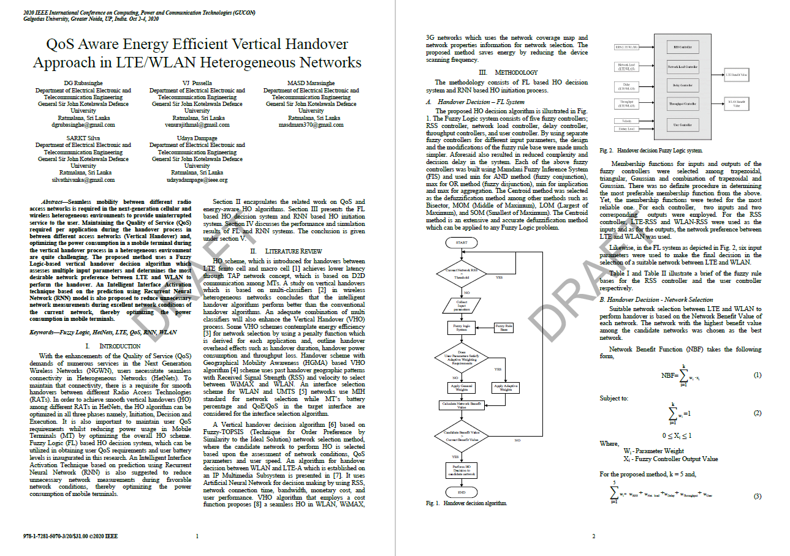
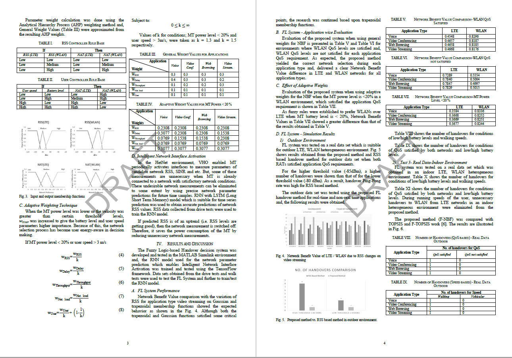
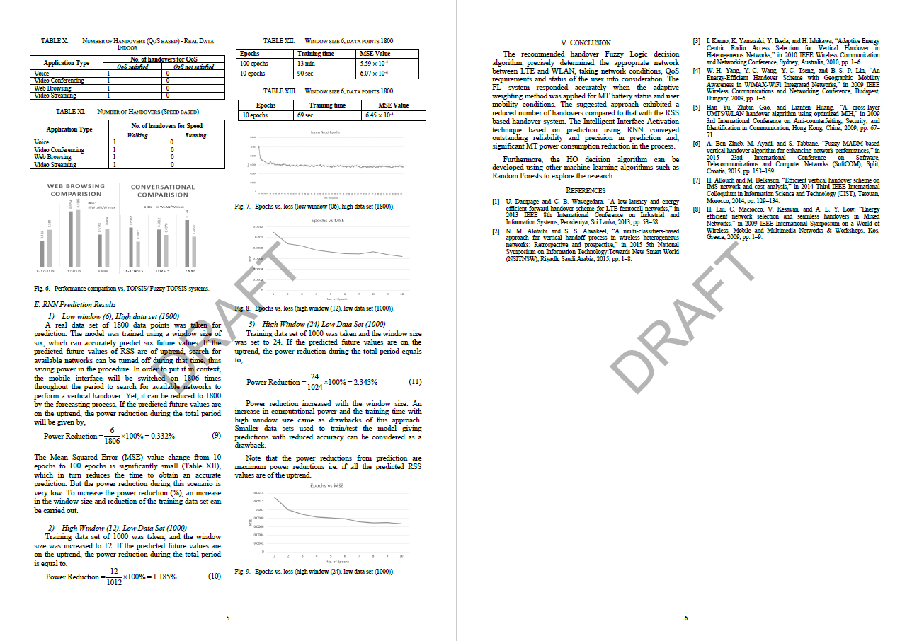

# QOS Aware Energy Efficient Vertical Handover (VHO) Approach in LTE/WLAN Heterogeneous Networks using ML & DL techniques.

 - Optimized the VHO Initiation Phase by an Prediction based Interface Activation technique using LSTM Networks.
 - Optimized the VHO Decision Phase using Fuzzy Logic Techniques.
 - Both optimizations were focused on conserving user power levels in LTE/WLAN HetNet environments.

Research paper published on IEEE GUCON 2020:

